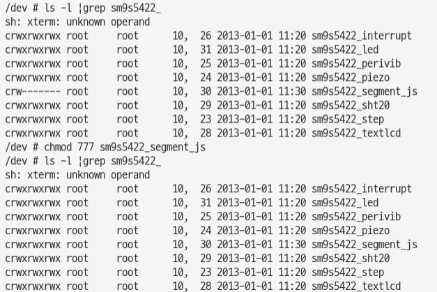

# segment module
insmod 후에 안드로이드 앱에서 인식해서 사용하려면 권한을 변경해 주어야 한다.



```
adb shell insmod /system/lib/modules/sm9s5422_segment_js.ko
adb shell chmod 777 /dev/sm9s5422_segment_js
adb shell lsmod| grep sm9s5422_segment

/etc/init.hanback.sh 에 insmod 추가해주어야 함
```